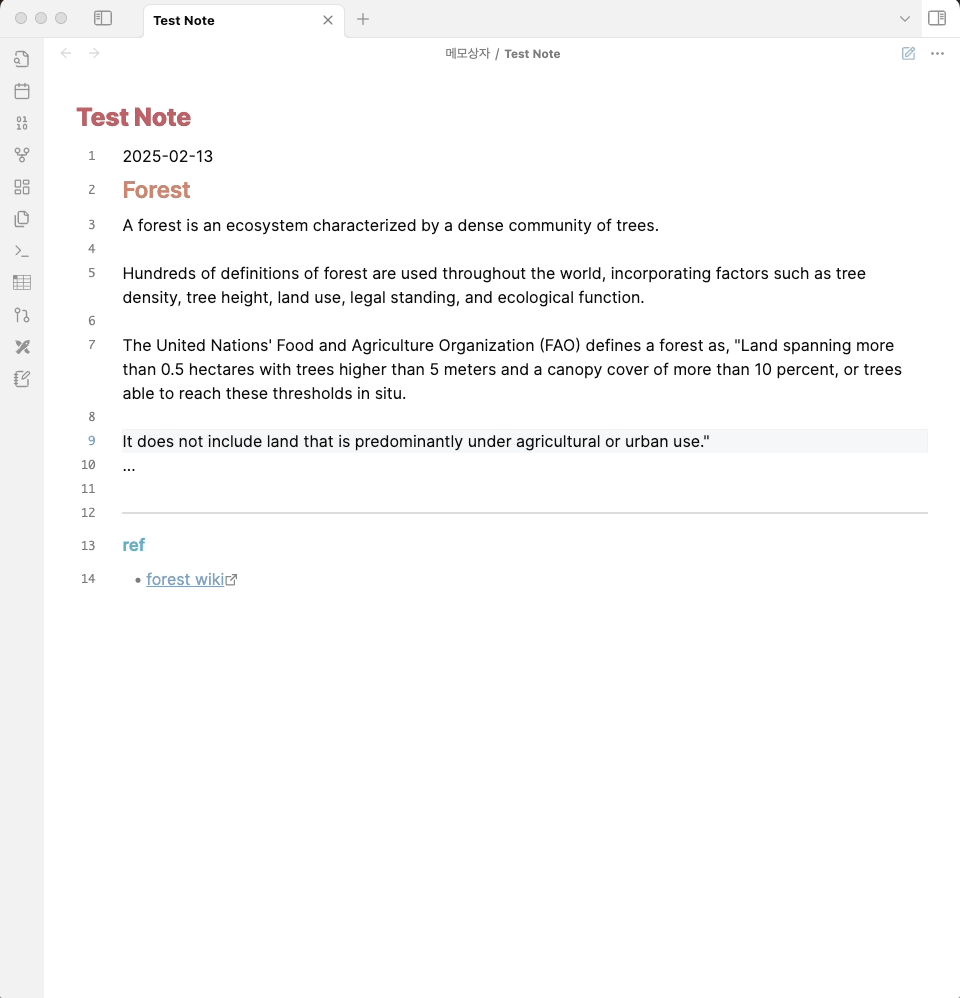
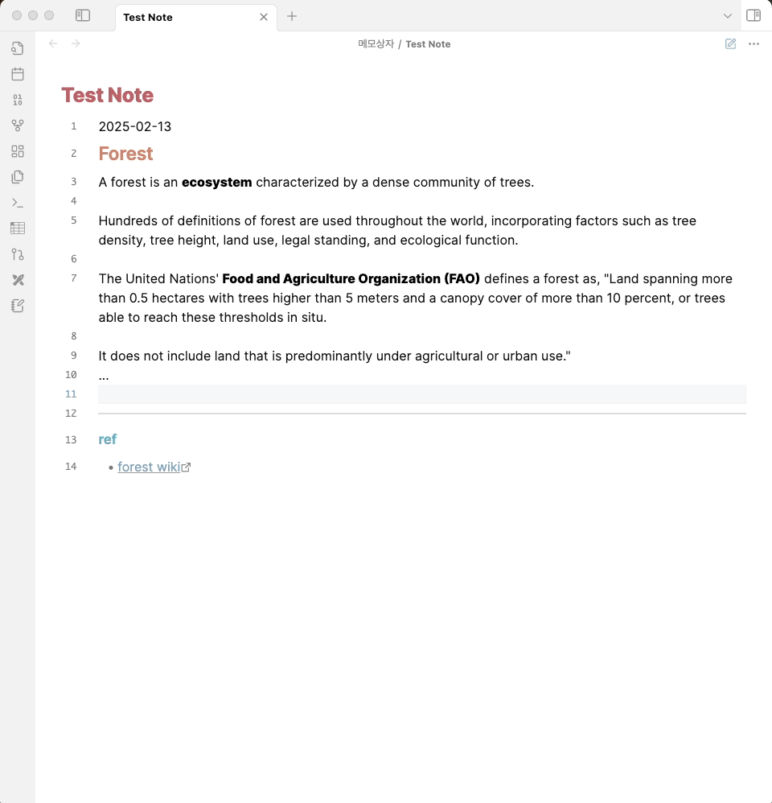

# Easy Test 

### Description
This plugin was created to help users make better use of their carefully written notes, **prevent them from being neglected**, and ultimately support users learning.

## Features
### Core
-   The plugin extracts bold text (**bold**) from the active editor and converts it into HTML input fields.
-   Displays the converted content in a modal for **easy interaction** ( click the ribbion button or use hotkey ).
-   Then user can enter their answers and check them in real time.

### Hint
- Users can also check the answer of the **focused input field** by clicking the Hint button located in the upper right corner

