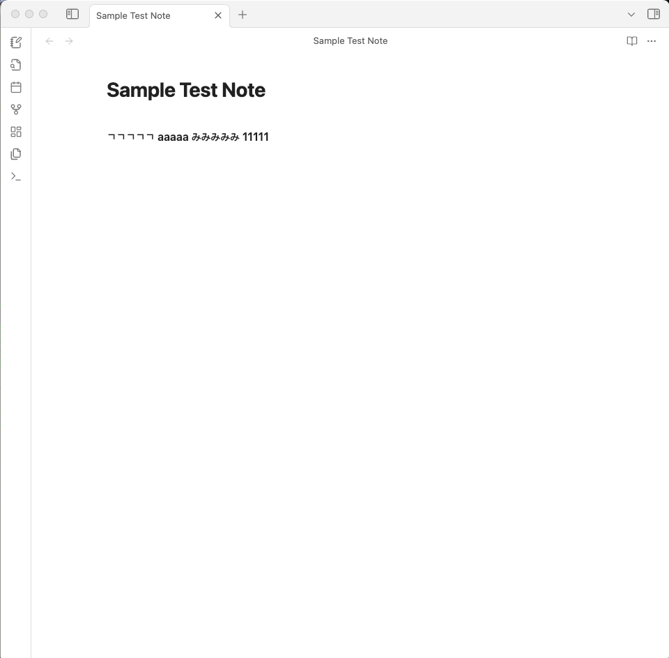

# Easy Test

## Description

This plugin was created to help users easily apply **retrieval practice** right inside Obsidian.
( Retrieval practice is a long-term memory technique introduced in [_The Study Algorithm_](https://m.yes24.com/Goods/Detail/109022621). A common way to use this technique is through self-testing, like giving yourself a mini quiz. )

**The purpose of this plugin is to make self-testing extremely quick and easy.**  
Because it’s so simple, users are more likely to give it a try, repeat it, and feel less stressed when learning — which ultimately supports their learning.

## Learning with Easy Test

1. Quickly go through books or materials, underlining key points.
2. Based on underlined key points, create a short Obsidian note.
3. Immediately test what you’ve learned using a plugin.
4. **Test again the next morning.**

To get the benefits of this plugin, it’s best to test yourself often.
That’s why I highly recommend **step 4**

## Features

### Core

-   The plugin extracts bold text (**bold**) from the active editor and converts it into HTML input fields.
-   Displays the converted content in a modal for **easy interaction** ( click the ribbion button or use hotkey ).
-   Then user can enter their answers and check them in real time.
-   

### Hint

-   Users can also check the answer of the **focused input field** by clicking the Hint button located in the upper right corner
-   

## Settings

-   User can easily configure input box colors (border & background) through a live-preview interface for seamless customization
-   
